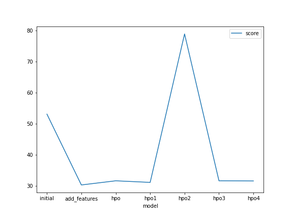
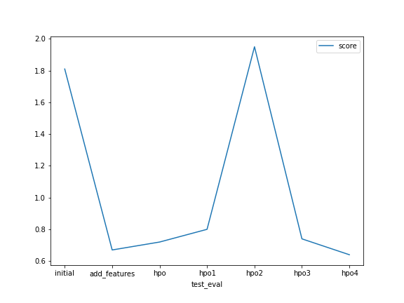

# Report: Predict Bike Sharing Demand with AutoGluon Solution
#### Vishnu Prabhat Sharma

## Initial Training
### What did you realize when you tried to submit your predictions? What changes were needed to the output of the predictor to submit your results?
Upon my first submission, I encountered with error that said "Kaggle not found". So, I pip installed kaggle, however prior to this I did find some difficulty in evaluating the number of negative values but I did figured it out before submitting my results & rest of code had no error.

### What was the top ranked model that performed?
My top ranked model was the one which I submitted after performing EDA & adding some more features which has a score of 0.67.

## Exploratory data analysis and feature creation
### What did the exploratory analysis find and how did you add additional features?
EDA found the relationship of all the features with respect to data so we got an overview of underlying trends & patterns in the data.
For adding additional features, I did take a hint from the notebook which suggested me to split datetime to separate columns & train the model again.

### How much better did your model preform after adding additional features and why do you think that is?
After adding additional features it went to a score of 0.67 from 1.80 which was score of initial training. So, it did perform better.

## Hyper parameter tuning
### How much better did your model preform after trying different hyper parameters?
Actually it did not perform so well, first I tried random search in which I tried to put hyperparameters from my intuition which perfromed fat worse than these above models so I searched for different methods to tune hyperparamters & it then used autogluon's library to set a range of hyperparameters to tune, it did performed a bit better with a score of .74 .

### If you were given more time with this dataset, where do you think you would spend more time?
I would spend more time to tune hyperparameters by finding different methods of tuning it.
I am still trying to tune it even after submitting the project. 

### Create a table with the models you ran, the hyperparameters modified, and the kaggle score.
model	time	hyperparameters	eval_metric	score
0	initial	600	default	default	1.81
1	add_features	600	default	default	0.67
2	hpo	    500	multimodal	mean_absolute_percentage_error	0.72
3	hpo1	500	hyperparameters_0	root_mean_squared_error	0.80
4	hpo2	600	hyperparameters	root_mean_squared_error	1.95
5	hpo3	800	hyperparametes3	root_mean_squared_error	0.74

### Create a line plot showing the top model score for the three (or more) training runs during the project.

TODO: Replace the image below with your own.

### Create a line plot showing the top kaggle score for the three (or more) prediction submissions during the project.

TODO: Replace the image below with your own.

## Summary
In conclusion, I would say the project taught me the importance of feature engineering & hyperparameter tuning. But most important lesson I learnt is machine learning it iterative process, I need to reiterate many times for a desirable model & I can't expect it to perform best in first run.
